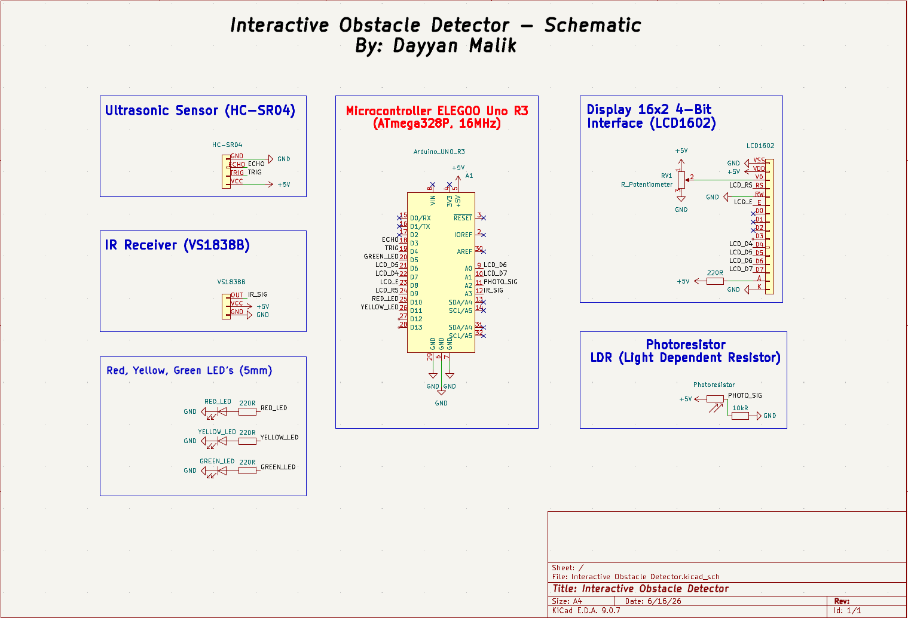
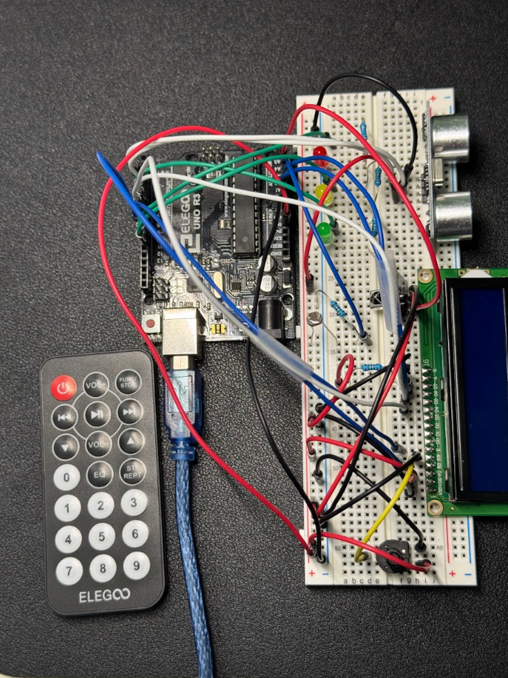
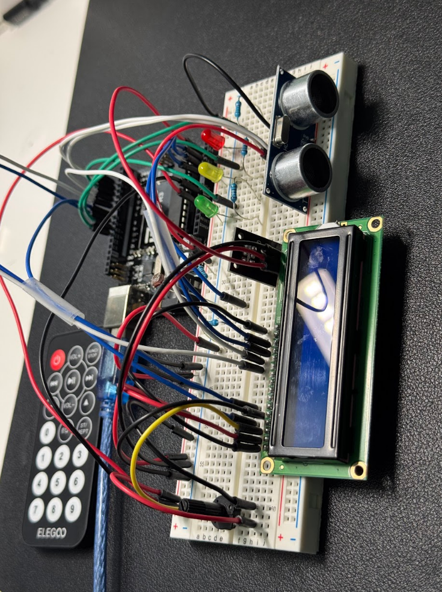
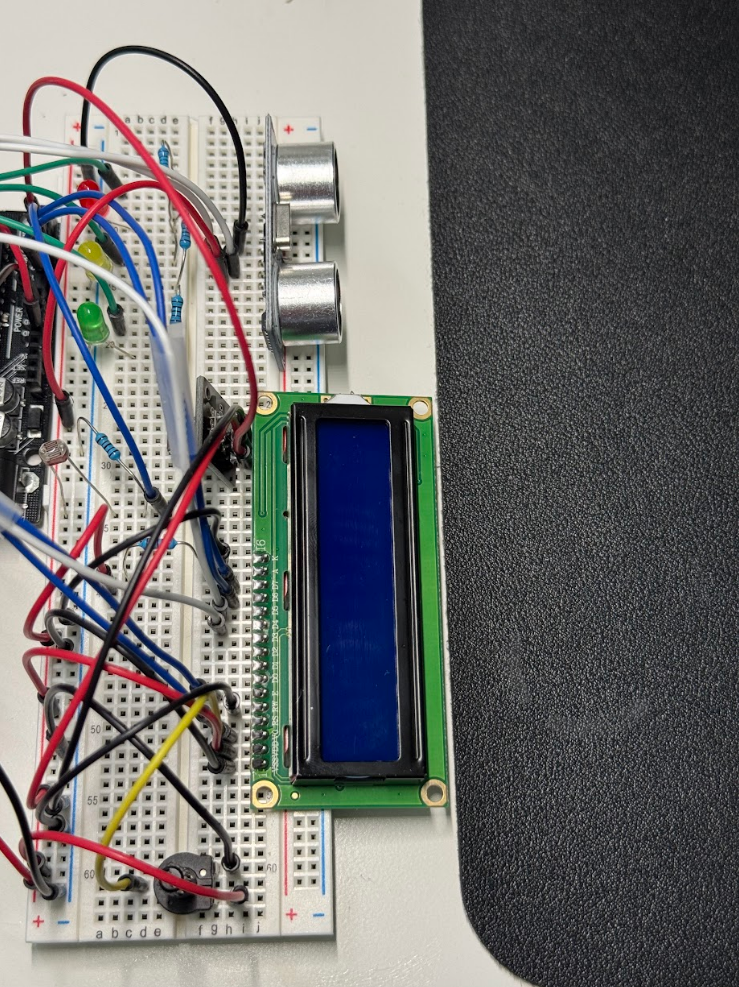
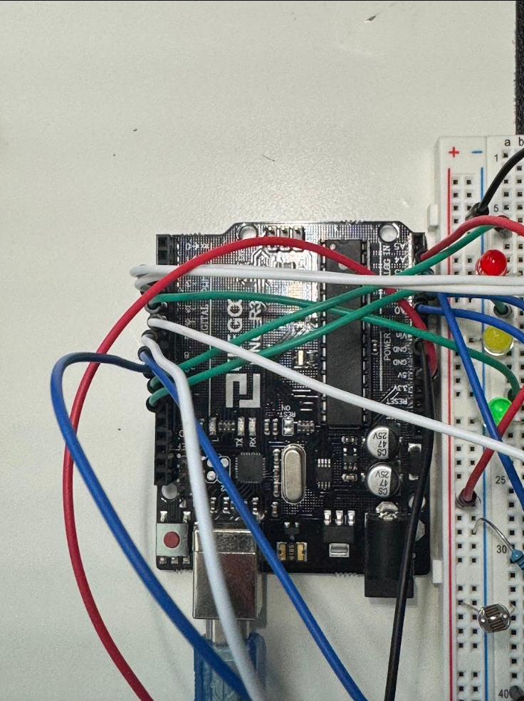

# Interactive Obstacle Detector

A real-time obstacle detection system built on the ELEGOO Uno R3. The circuit was first drafted as a formal schematic in KiCad before being implemented on a breadboard — ensuring every connection was planned and verified before any wire was placed. The system uses an HC-SR04 ultrasonic sensor to measure distance, triggers visual LED alerts, and displays live readings on an LCD screen. When an object gets too close the system locks itself into an alarm state and can only be unlocked via IR remote. A photoresistor monitors ambient light and automatically adjusts a green LED's brightness in response.

[Demo Video - Unedited (Raw)](https://youtube.com/shorts/-8XIuKnaVVs)
[Demo Video - Edited](https://youtu.be/fN4enswhWk0)

---

## Table of Contents

- [Overview](#overview)
- [Real World Application](#real-world-application)
- [Hardware](#hardware)
- [Circuit & Wiring](#circuit--wiring)
  - [Physical Layout Strategy](#physical-layout-strategy)
  - [KiCad Schematic](#kicad-schematic)
  - [Project Images](#project-images)
  - [Pin Reference](#pin-reference)
- [How Everything Works Together](#how-everything-works-together)
  - [Distance Detection](#distance-detection)
  - [LED Feedback System](#led-feedback-system)
  - [LCD Display](#lcd-display)
  - [IR Remote Control](#ir-remote-control)
  - [Photoresistor & Ambient Light](#photoresistor--ambient-light)
  - [EEPROM Persistence](#eeprom-persistence)
- [Key Programming Concepts](#key-programming-concepts)
  - [Non-Blocking Timing](#non-blocking-timing)
  - [Hardware Interrupts](#hardware-interrupts)
  - [Complementary Filter](#complementary-filter)
  - [Lock & Unlock State Machine](#lock--unlock-state-machine)
  - [LCD Screen Navigation](#lcd-screen-navigation)
- [Libraries](#libraries)
- [Getting Started](#getting-started)
- [Project Structure](#project-structure)
- [License](#license)
- [Author](#author)

---

## Overview

This project started as the final capstone of an Arduino fundamentals course and grew into a fully functional embedded system that demonstrates real hardware-software integration. Before a single wire was placed on the breadboard, the entire circuit was mapped out in KiCad — every component, every connection, every power rail — so the implementation phase was deliberate rather than trial and error.

Every major concept from the course — interrupts, non-blocking timing, EEPROM, IR decoding, PWM, and analog sensing — is applied here in a way that makes them work together rather than in isolation.

The core idea is simple: an ultrasonic sensor watches for nearby objects, a set of LEDs gives instant visual feedback on proximity, and an LCD provides detailed readable information. When something gets too close, the system locks into an alarm state. Everything runs simultaneously with no blocking delays anywhere in the main loop.

---

## Real World Application

This kind of system has direct parallels in industry:

**Parking sensors** in vehicles use the exact same principle — ultrasonic distance measurement with escalating alerts as an object gets closer. The yellow LED blink rate increasing with proximity mirrors how parking beepers speed up.

**Intrusion detection** systems use proximity triggers to lock down or alert when something enters a defined range. The lock/unlock mechanic in this project is a simplified version of that.

**Automated lighting** — the photoresistor driving the green LED inversely is the same logic behind automatic street lights and screen brightness adjustment on phones. Darker environment, more light output.

**Industrial proximity switches** on conveyor belts and assembly lines use ultrasonic sensors to detect when a part is in position before triggering the next step in a process.

The combination of sensor input, state-based logic, persistent settings, and remote control in one compact system is exactly the kind of embedded firmware pattern used in consumer electronics, automotive systems, and industrial automation.

---

## Hardware

| Component | Details |
|---|---|
| Microcontroller | ELEGOO Uno R3 (ATmega328P, 16MHz) |
| Distance Sensor | HC-SR04 Ultrasonic Sensor |
| Display | LCD1602 (16x2, parallel 4-bit interface) |
| IR Receiver | VS1838B IR Receiver Module |
| IR Remote | ELEGOO IR Remote |
| LEDs | Red, Yellow, Green (5mm) |
| Resistors | 220Ω × 3 (LEDs), 10kΩ × 1 (photoresistor voltage divider) |
| Photoresistor | LDR (Light Dependent Resistor) |
| Potentiometer | 10kΩ (LCD contrast control) |
| Other | Breadboard, jumper wires, USB-B cable |

---

## Circuit & Wiring

### Physical Layout Strategy

How components are physically placed on the breadboard matters more than most beginners realize. Poor placement causes signal interference, makes wiring harder to follow, and can even affect sensor accuracy.

**Ultrasonic Sensor — Place at the top edge of the breadboard**
The HC-SR04 works by sending sound waves out and listening for the echo. If it's placed in the middle of the breadboard, other components in front of it reflect the sound back and cause false readings. Mounting it at the very top edge of the breadboard gives it a clean line of sight with nothing obstructing its field of view. The LEDs are placed directly behind it in a row — this mirrors how they function in the program, where LED behavior is directly driven by the distance the sensor reads.

**LCD — Place along the bottom edge, hanging off the breadboard**
The LCD1602 is the largest component in this build. If placed entirely on the breadboard it consumes most of the available rows and leaves little room for anything else. Instead, position it at the bottom edge so roughly half hangs off, with only the pin row sitting in the breadboard. This keeps the rest of the board accessible and the wiring clean.

**Photoresistor — Place in the center of the board with no wires running directly over it**
A photoresistor reads ambient light. If wires are run over it or components are stacked next to it, they cast shadows and skew the reading toward whatever is directly above the sensor rather than the actual room light level. Placing it in the center of the board with clear space around it lets it average light from the whole board environment rather than reading a localized pocket of shadow.

**LEDs — Place directly behind the ultrasonic sensor in a row**
Red, yellow, and green LEDs sit in a row just behind the HC-SR04. This placement is intentional — it visually communicates the relationship between detection and feedback. When someone looks at the circuit, the LEDs are the first thing they see react when an object approaches the sensor in front of them.

---

### KiCad Schematic

The full circuit was designed in KiCad before breadboard implementation. The schematic covers all component connections, power rails, and signal routing across six grouped blocks — microcontroller, distance sensor, IR receiver, visual indicators, LCD display, and ambient light sensor.



---

### Project Images

### Full Circuit



---

### Breadboard Wiring


---

### Uno R3 Pin Connections


---

### Pin Reference

| Component | Arduino Pin |
|---|---|
| Red LED | D10 |
| Yellow LED | D11 |
| Green LED | D5 (PWM) |
| LCD RS | D9 |
| LCD E | D8 |
| LCD D4 | D7 |
| LCD D5 | D6 |
| LCD D6 | A0 |
| LCD D7 | A1 |
| IR Receiver Signal | A3 |
| Ultrasonic Trig | D4 |
| Ultrasonic Echo | D3 (Interrupt) |
| Photoresistor | A2 |

> **Note on LCD pins:** Analog pins A0 and A1 are used as digital output pins for the LCD data lines. The ATmega328P supports this — any analog pin can be used as a digital I/O when `pinMode` is set to OUTPUT.

> **Note on green LED pin:** D5 is a PWM-capable pin on the Uno R3, which is required for `analogWrite` to control brightness. Not all digital pins support PWM — only those marked with `~` on the board.

---

## How Everything Works Together

The system runs entirely inside `loop()` with no `delay()` calls anywhere in the main execution path. Every component is managed by its own independent timer using `millis()`, so they all operate simultaneously without blocking each other.

### Distance Detection

The HC-SR04 works in two parts — a trigger and an echo. The trigger pin is pulled HIGH for 10 microseconds which causes the sensor to fire 8 ultrasonic bursts. The echo pin then goes HIGH for exactly as long as it takes the sound to travel to the object and back. Measuring that duration and dividing by 58 gives the distance in centimeters.

```cpp
void trigUltrasonicSensor() {
    digitalWrite(trig_pin, LOW);
    delayMicroseconds(2);       // clean baseline before trigger
    digitalWrite(trig_pin, HIGH);
    delayMicroseconds(10);      // 10 microsecond pulse
    digitalWrite(trig_pin, LOW);
}
```

The sensor is triggered every 60ms via a millis timer. The echo timing is handled by a hardware interrupt on pin 3 rather than `pulseIn()` — this is important because `pulseIn()` is a blocking function that freezes the entire program while it waits. With an interrupt, the program never pauses:

```cpp
void echoPinInterrupt() {
    if (digitalRead(echo_pin) == HIGH) {
        pulseInBegin = micros();   // rising edge: sound left the sensor
    } else {
        pulseInEnd = micros();     // falling edge: echo returned
        newDistanceAvailable = true;
    }
}
```

The duration is `pulseInEnd - pulseInBegin` and the flag tells `loop()` a fresh reading is ready.

---

### LED Feedback System

All three LEDs serve a distinct purpose and are never in conflict with each other.

**Yellow LED** blinks at a rate proportional to distance. The further away an object is, the slower the blink. The closer it gets, the faster it blinks — mimicking a parking sensor. The blink rate is capped at a minimum of 30ms so it never appears to be stuck on solid:

```cpp
void setYellowLEDBlinkRateFromDistance(double distance) {
    yellowLEDDelay = distance * 4;
    if (yellowLEDDelay < 30) yellowLEDDelay = 30;
}
```

**Red LED** only activates when the system is locked. When locked, both the red and yellow LEDs blink together at 100ms — a fast alternating pattern that signals an alarm state.

**Green LED** is driven by the photoresistor using `analogWrite` on a PWM pin. The mapping is inverted so the LED gets brighter as the room gets darker:

```cpp
void setGreenLEDFromLuminosity(int luminosity) {
    int brightness = map(luminosity, 0, 1023, 255, 0);
    analogWrite(greenLED_pin, brightness);
}
```

---

### LCD Display

The LCD runs in 4-bit parallel mode, meaning data is sent in two 4-bit chunks instead of all 8 bits at once. This halves the number of data pins needed without any loss in functionality. The display has three screens the user can navigate between:

**Distance Screen** — shows live distance in either cm or inches, and a warning message if an object is within 60cm.

**Settings Screen** — displays instructions for resetting to default settings. The OFF button on the IR remote only works on this screen, preventing accidental resets.

**Luminosity Screen** — shows the raw photoresistor reading so the user can see what the sensor is picking up.

Rather than calling `lcd.clear()` every update — which causes visible flicker — text is padded with trailing spaces to overwrite whatever was previously on that row without clearing the whole display.

When the system is locked, all three screens are overridden and the LCD shows the obstacle warning regardless of which screen was active.

---

### IR Remote Control

The IR receiver decodes signals from the ELEGOO remote using the IRremote v3 library. Each button maps to a specific action:

| Button | Action |
|---|---|
| Play | Unlock the system, return to distance screen |
| EQ | Toggle distance unit between cm and inches |
| Up | Navigate to next LCD screen |
| Down | Navigate to previous LCD screen |
| Off | Reset all settings to default (only works on settings screen) |

The command is read from `IrReceiver.decodedIRData.command` and passed into a switch statement that routes it to the appropriate function. `IrReceiver.resume()` is called immediately after decoding so the receiver is ready for the next signal.

---

### Photoresistor & Ambient Light

The photoresistor is wired as a voltage divider with a 10kΩ resistor between the signal pin and GND. As light increases, the photoresistor's resistance drops, which raises the voltage at the analog pin and produces a higher `analogRead` value. The full range is 0 (complete darkness) to 1023 (maximum brightness).

This reading is sampled every 100ms — fast enough to respond to light changes but not so fast it burns unnecessary CPU cycles. The raw value drives both the green LED brightness and the luminosity LCD screen.

---

### EEPROM Persistence

The distance unit preference (cm or inches) is saved to EEPROM address 50 every time the user changes it. On boot, the program reads that address back and restores the last used unit. If the address has never been written (default value of 255), it falls back to cm:

```cpp
distanceUnit = EEPROM.read(eeprom_address_distance_unit);
if (distanceUnit == 255) {
    distanceUnit = distance_unit_cm;
}
```

This means the user's preference survives power cycles without any manual re-configuration.

---

## Key Programming Concepts

### Non-Blocking Timing

Every timed action in this program uses `millis()` instead of `delay()`. `delay()` freezes the entire CPU — nothing else can run during it. `millis()` just returns how many milliseconds have passed since boot. By storing when something last happened and checking if enough time has elapsed, the program can run multiple independent timers at once:

```cpp
if (timeNow - lastUltrasonicTrig >= ultrasonicTrigDelay) {
    lastUltrasonicTrig += ultrasonicTrigDelay;
    trigUltrasonicSensor();
}
```

The ultrasonic trigger, LED blink timers, luminosity sampler, and LCD updates all run on separate independent intervals this way — none of them know or care what the others are doing.

---

### Hardware Interrupts

Pin 3 on the Uno R3 is one of two pins that supports hardware interrupts (the other is pin 2). A hardware interrupt fires the moment a signal change is detected on that pin — it doesn't wait for `loop()` to come around and check. This is critical for ultrasonic echo timing because the echo pulse can be as short as a few hundred microseconds. Polling it in `loop()` would miss it entirely.

The ISR (Interrupt Service Routine) is kept as short as possible — just recording timestamps and setting a flag. All the actual computation happens back in `loop()` where there are no timing restrictions.

---

### Complementary Filter

Raw ultrasonic readings jump around slightly between measurements due to air currents, surface reflections, and sensor noise. A complementary filter blends the previous reading with the new one to smooth the output:

```cpp
distance = previousDistance * 0.60 + distance * 0.40;
```

This weights the result 60% toward the historical value and 40% toward the new reading. The distance still responds to real changes quickly but doesn't spike from momentary noise. The weights can be tuned — more weight on the new reading makes it more responsive but noisier, more weight on history makes it smoother but slower to react.

---

### Lock & Unlock State Machine

The system has two states — locked and unlocked — controlled by a single boolean `isLocked`. The entire behavior of LEDs, LCD output, and which IR commands are accepted changes based on this flag. This is a basic state machine pattern common in embedded firmware:

- **Unlocked state:** yellow LED blinks at distance-dependent rate, LCD shows distance data, all IR commands active
- **Locked state:** red and yellow LEDs blink together at 100ms, LCD shows obstacle warning, only the play button works to unlock

The lock triggers automatically when distance drops below 15cm. Unlock only happens via the IR play button — there is no automatic unlock, requiring deliberate human intervention.

---

### LCD Screen Navigation

Three LCD screens are cycled using a `lcdMode` variable and a switch statement inside `toggleLCDScreen()`. Pressing up or down on the IR remote passes a boolean into the function — `true` for next, `false` for previous — and the switch determines which screen to move to based on the current one:

```cpp
void toggleLCDScreen(bool next) {
    switch (lcdMode) {
        case lcd_mode_distance:
            lcdMode = (next) ? lcd_mode_settings : lcd_mode_luminosity;
            break;
        case lcd_mode_settings:
            lcdMode = (next) ? lcd_mode_luminosity : lcd_mode_distance;
            break;
        case lcd_mode_luminosity:
            lcdMode = (next) ? lcd_mode_distance : lcd_mode_settings;
            break;
    }
    lcd.clear();
}
```

The screens cycle in a loop — distance → settings → luminosity → distance — in both directions.

---

## Libraries

| Library | Version | Purpose |
|---|---|---|
| LiquidCrystal | Built-in | Parallel LCD communication |
| IRremote | v3.x | IR signal decoding |
| EEPROM | Built-in | Persistent storage |

Install IRremote via the Arduino IDE Library Manager: **Sketch → Include Library → Manage Libraries → search "IRremote" → install version 3.x by shirriff/z3t0**

---

## Getting Started

1. Clone or download this repository
2. Open `obstacle_detector.ino` in the Arduino IDE
3. Install the IRremote library (v3.x) via Library Manager
4. Wire all components according to the pin reference table above
5. Upload the sketch to your ELEGOO Uno R3
6. Open Serial Monitor at **115200 baud** for debug output (optional)

**First boot:** The LCD will show "Initializing..." for one second then switch to the distance screen. If the screen is blank or shows only black boxes, turn the contrast potentiometer connected to the LCD V0 pin until text appears.

**Finding your IR button codes:** Every remote is slightly different. If the IR buttons don't respond as expected, upload the scanner sketch below first to find your remote's actual codes, then update the `#define` values at the top of the main sketch:

```cpp
#include <IRremote.h>
void setup() {
    Serial.begin(115200);
    IrReceiver.begin(A3);
}
void loop() {
    if (IrReceiver.decode()) {
        Serial.println(IrReceiver.decodedIRData.command);
        IrReceiver.resume();
    }
}
```

---

## Project Structure

```
interactive-obstacle-detector/
├── obstacle_detector.ino
├── README.md
├── LICENSE
└── images/
    ├── kicad-schematic.png
    ├── full-circuit-top.png
    ├── full-circuit-angled.png
    ├── breadboard-wiring.png
    └── uno-wiring.png
```

---

## License

MIT License — see [LICENSE](LICENSE) for full text.

Copyright (c) 2026 Dayyan Malik

---

## Author

**Dayyan Malik**
B.S. Computer Engineering — Georgia State University
[LinkedIn](https://www.linkedin.com/in/dayyan-m-profile) · [GitHub](https://github.com/dayyan7)
